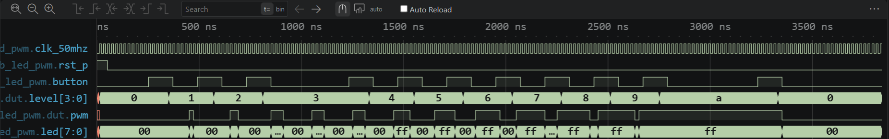

# 실험 전 레포트: LAB3-19 · PWM LED 밝기

작성자: 박건우 (2025440050) / 작성일: 2026-09-26 / 소스 커밋: [bd97662](https://github.com/bandnewbie/UOS_ECE_project3/commit/bd976622c324f9dd08479164d65265530460d6a1) / workspace: `lab3_19_led_pwm/FPGA.code-workspace` / OS: Windows / Python: Python 3.14.7 / 시뮬레이터 버전: Icarus Verilog 12.0 (devel) (s20150603-1539-g2693dd32b)

## 목적과 예상 동작

버튼을 한 번 누를 때마다 duty를 10%씩 바꾸고 8개 LED에 같은 PWM을 출력한다 [1].

버튼 입력은 `button_onepulse`에서 2단 플립플롭(`button_meta`→`button_sync`)으로 동기화한 뒤, 값이 `STABLE_CYCLES` 동안 유지되면 새 값으로 인정하고 눌림(0→1)일 때만 1클록 폭의 `press`를 만든다 [1, 2].

`level`은 `press`마다 0→1→…→10으로 증가하고 10(=`LEVELS`) 다음에는 0으로 돌아간다. `pwm_channel`은 `count`를 0부터 `PERIOD_CYCLES-1`까지 반복하며 `pwm <= (count < threshold)`로 출력한다. `threshold = PERIOD_CYCLES×level/LEVELS`이고 `level ≥ LEVELS`이면 한 주기 전체가 HIGH이다. LED 8개는 `{8{pwm}}`로 같은 신호를 받으므로 duty = level×10%이다 [1].

핵심 파라미터 계산

| 항목 | 보드 (50 MHz) | TB |
|---|---|---|
| PWM 주기 `CLK_HZ/PWM_HZ` | 50,000,000/1,000 = 50,000클록 (1 ms) | 1,000/100 = 10클록 (200 ns) |
| 한 단계(10%) HIGH 폭 | 5,000클록 = 100 µs | 1클록 = 20 ns |
| 디바운스 `DEBOUNCE_CYCLES` | 1,000,000클록 = 20 ms | 2클록 |
| counter 폭 | `count` 16비트, `stable_count` 20비트 | `count` 4비트 |

## 소스와 테스트벤치

- 설계 top: `lab3_led_pwm` / 시뮬레이션 top: `tb_led_pwm`
- RTL: [button_onepulse.v](../../lab3_19_led_pwm/src/button_onepulse.v), [pwm_channel.v](../../lab3_19_led_pwm/src/pwm_channel.v), [lab3_led_pwm.v](../../lab3_19_led_pwm/src/lab3_led_pwm.v)
- TB: [tb_led_pwm.sv](../../lab3_19_led_pwm/sim/tb_led_pwm.sv)
- XDC: [lab3_led_pwm.xdc](../../lab3_19_led_pwm/constraints/lab3_led_pwm.xdc)
- 기대 PASS: `LAB3_LED_PWM_PASS checks=4`

RTL은 버튼 원펄스(`button_onepulse`), PWM 발생(`pwm_channel`), 단계 레지스터와 LED 연결(`lab3_led_pwm`, 설계 top)로 나뉜다. TB `tb_led_pwm`은 가속 파라미터로 DUT를 만들고 PWM 한 주기(10클록)의 HIGH 개수를 `led[0]`에서 센다. XDC는 clk_50mhz B6, rst_p K4, 버튼 N8, LED[7:0] N5/M1/M3/M7/N7/M2/M4/L4 핀과 LVCMOS33, 20.000 ns 클록 제약을 담당한다 [1].

TB 자극과 기대 결과

| 순서 | TB 자극 | 기대 결과 (한 주기 HIGH 클록) |
|---|---|---|
| 1 | 리셋 3클록 후 해제 | level 0 → 0 |
| 2 | 버튼 3회 (1회 = 6클록 HIGH + 6클록 LOW) | level 3 → 3 |
| 3 | 버튼 7회 추가 | level 10 → 10 (100%) |
| 4 | 버튼 1회 추가 | level 0으로 순환 → 0 |

## VS Code 실행 과정

File → Save All → Run Task 01 Check tools → 02 Simulate → 03 Open waveform 순서로 실행했다. 02 Simulate 결과 `LAB3_LED_PWM_PASS checks=4`를 확인했다.

- PASS 로그: [simulation.txt](../../evidence/19/vscode/simulation.txt)
- 파형: [wave.vcd](../../evidence/19/vscode/wave.vcd)

| 시간 구간 | 입력 | 예상 | 실제 파형 | 해석 |
|---|---|---|---|---|
| 0–50 ns | rst_p=1 | level 0, pwm 0 | level 0, pwm 0 | 리셋 유지 |
| 251→350 ns | button 1회째 상승 | 5클록 뒤 level 갱신 | 350 ns에 level 1 | 동기화 2 + 안정 2 + 원펄스 1클록 |
| 810–1330 ns | 3회 누름 완료 | HIGH 3클록 | pwm 1250–1310 ns (60 ns) | duty 30% |
| 2750–3330 ns | 10회 누름 완료 | 주기 전체 HIGH | pwm 2650–3350 ns 연속 1 | level A(10) = 100% |
| 3330 ns 이후 | 11회째 누름 | level 0, HIGH 0 | level 0, pwm 0 | 10 다음 0으로 순환 |

level이 0→1→2→3에서 멈춘 뒤 3→A(10)→0으로 이동하고, level이 커질수록 pwm HIGH 폭이 1클록씩 넓어진다. level A 구간은 pwm이 계속 1이며 led는 pwm을 따라 00/FF를 반복한다. 종료 시각은 3,831 ns이다.

경계 조건은 level 10(threshold = 주기 전체, LOW 없음), 그 다음 누름의 0 순환, level 0(HIGH 없음)이다.

## 코드 수정·실패·복구 실험

변경 위치: `sim/tb_led_pwm.sv` 7행의 DUT 파라미터 `LEVELS(10)` → `LEVELS(5)`

실행 전 예상: threshold = 10×3/5 = 6이므로 level 3에서 HIGH 6클록이 되어 기대값 3과 달라진다. 첫 검사(level 0)는 통과한다.

| 단계 | 실행 폴더·로그 | 입력·기대값·실제값 | 해석 |
|---|---|---|---|
| 정상 (22:16:30) | run-f31a66e8… / simulation.txt | LEVELS=10, 기대 0/3/10/0 → PASS checks=4, 3,831 ns | 기준 동작 |
| 변경 (22:21:46) | run-01e5a31e… / simulation_modified.txt | LEVELS=5, level 3 기대 3 → FATAL level=3 high=6, 1,231 ns | 단계당 폭이 2배(20%)가 되어 두 번째 검사에서 검출 |
| 복구 (22:25:47) | run-fdc523a8… / simulation_restored.txt | LEVELS=10 → PASS checks=4, 3,831 ns | 원래 동작 재현 |

TB의 기대값은 바꾸지 않았다. 세 실행은 모두 `lab3_19_led_pwm/build/sim/` 아래 run 폴더에 있고, 로그를 `evidence/19/vscode/`에 복사했다.

## 보드 실험 계획

- 전원을 끈 상태에서 결선과 공통 GND를 확인하고, Program Device로 bit를 기록한다 [1].
- N8 버튼을 누를 때마다 밝기가 한 단계씩 오르는지, 0%·100%·중간 밝기를 관찰한다 [1]. 1 kHz PWM이므로 깜박임 없이 밝기만 달라질 것으로 예상한다.
- 100% 다음 누름에서 소등(0%)으로 돌아가는지 확인하고, 보드 전체·사용 핀 사진과 버튼 조작·LED 변화 영상을 남긴다 [1].

이 단계에서는 Vivado·보드 결과를 기록하지 않는다.

## 참고문헌

[1] 서울시립대학교 전자전기컴퓨터공학부, "전자전기컴퓨터설계실험Ⅱ LAB3 교안: FPGA 응용회로 공통 예습 및 LAB3-19–25 Vivado 매뉴얼", 2026.

[2] M. Morris Mano and Michael D. Ciletti, *Digital Design: With an Introduction to the Verilog HDL, VHDL, and SystemVerilog*, 6th ed., Pearson, 2018.
