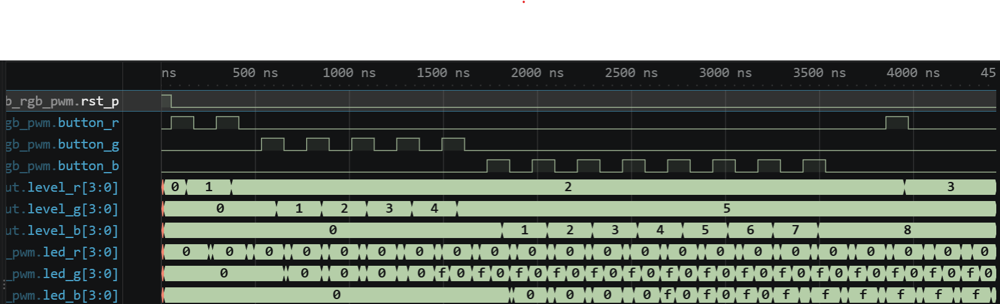

# 실험 전 레포트: LAB3-20 · RGB LED PWM

작성자: 박건우 (2025440050) / 작성일: 2026-09-26 / 소스 커밋: [bd97662](https://github.com/bandnewbie/UOS_ECE_project3/commit/bd976622c324f9dd08479164d65265530460d6a1) / workspace: `lab3_20_rgb_pwm/FPGA.code-workspace` / OS: Windows / Python: Python 3.14.7 / 시뮬레이터 버전: Icarus Verilog 12.0 (devel) (s20150603-1539-g2693dd32b)

## 목적과 예상 동작

R·G·B 버튼으로 세 PWM duty를 독립적으로 바꾸고 네 개 RGB LED에 출력한다 [1].

버튼마다 `button_onepulse`를 하나씩 두어 `press_r/g/b`를 만들고, 레지스터 `level_r/g/b`를 각각 0~10으로 순환시킨다 [1].

세 `pwm_channel`은 같은 `PERIOD_CYCLES`를 쓰므로 주기는 공통이고 duty만 채널별로 다르다. 세 색의 duty 비율로 혼합색이 정해진다 [1].

`led_r/g/b`는 각각 `{4{pwm_x}}`로 4개 RGB LED의 같은 색에 연결된다.

핵심 파라미터 계산

| 항목 | 보드 (50 MHz) | TB |
|---|---|---|
| 공통 PWM 주기 | 50,000클록 (1 ms, 1 kHz) | 10클록 (200 ns) |
| 한 단계 HIGH 폭 | 5,000클록 = 100 µs | 1클록 |
| 디바운스 | 1,000,000클록 = 20 ms | 2클록 |

## 소스와 테스트벤치

- 설계 top: `lab3_rgb_pwm` / 시뮬레이션 top: `tb_rgb_pwm`
- RTL: [button_onepulse.v](../../lab3_20_rgb_pwm/src/button_onepulse.v), [pwm_channel.v](../../lab3_20_rgb_pwm/src/pwm_channel.v), [lab3_rgb_pwm.v](../../lab3_20_rgb_pwm/src/lab3_rgb_pwm.v)
- TB: [tb_rgb_pwm.sv](../../lab3_20_rgb_pwm/sim/tb_rgb_pwm.sv)
- XDC: [lab3_rgb_pwm.xdc](../../lab3_20_rgb_pwm/constraints/lab3_rgb_pwm.xdc)
- 기대 PASS: `LAB3_RGB_PWM_PASS checks=2`

설계 top `lab3_rgb_pwm`은 버튼 원펄스 3개, level 레지스터 3개, `pwm_channel` 3개로 구성된다. TB `tb_rgb_pwm`은 R·G·B 버튼 태스크와 세 채널의 HIGH 개수를 동시에 세는 `measure`를 가진다. XDC는 버튼 N8/N4/N1, led_r T2/U1/P2/R3, led_g U5/V1/R7/T6, led_b U3/W2/R5/T3 핀과 20 ns 클록을 지정한다 [1].

TB 자극과 기대 결과

| 순서 | TB 자극 | 기대 결과 (R, G, B HIGH 클록) |
|---|---|---|
| 1 | R 2회, G 5회, B 8회 | (2, 5, 8) = 20%, 50%, 80% |
| 2 | R 1회 추가 | (3, 5, 8) — R만 한 단계 증가 |

## VS Code 실행 과정

File → Save All → Run Task 01 Check tools → 02 Simulate → 03 Open waveform 순서로 실행했다. 02 Simulate 결과 `LAB3_RGB_PWM_PASS checks=2`를 확인했다.

- PASS 로그: [simulation.txt](../../evidence/20/vscode/simulation.txt)
- 파형: [wave.vcd](../../evidence/20/vscode/wave.vcd)

| 시간 구간 | 입력 | 예상 | 실제 파형 | 해석 |
|---|---|---|---|---|
| 50 ns | 리셋 해제 | 세 level 0 | level_r/g/b = 0 | 초기 상태 |
| 130–370 ns | button_r 2회 | level_r 2 | 130 ns에 1, 370 ns에 2 | R만 변화 |
| 610–1570 ns | button_g 5회 | level_g 5 | 1,570 ns에 5 | G만 변화 |
| 1810–3490 ns | button_b 8회 | level_b 8 | 3,490 ns에 8 | B만 변화 |
| 3950 ns | button_r 1회 | level_r 3, G·B 유지 | level_r 3, G 5, B 8 | 채널 독립성 |

한 버튼을 누르는 동안 해당 색의 level만 올라가고 나머지 두 채널은 그대로다. led_g, led_b는 duty에 비례해 0/F 구간 길이가 달라지며, 마지막 R 누름 뒤에도 G·B 파형은 변하지 않는다. 종료 시각은 4,431 ns이다.

각 채널은 독립적으로 10 다음 0으로 순환하도록 작성되어 있다. 이번 TB는 한 채널을 최대 8단계까지만 누르므로 10→0 순환은 이 TB의 검사 범위에 포함되지 않는다.

## 코드 수정·실패·복구 실험

변경 위치: `src/lab3_rgb_pwm.v` 30행 리셋값 `level_r <= 0` → `level_r <= 3` (R의 초기 duty만 변경)

실행 전 예상: R은 3에서 시작하므로 2회 누름 뒤 5가 되어 (5, 5, 8)이 된다. G·B는 영향을 받지 않는다.

| 단계 | 실행 폴더·로그 | 입력·기대값·실제값 | 해석 |
|---|---|---|---|
| 정상 (22:27:24) | run-698a7537… / simulation.txt | 기대 (2,5,8)·(3,5,8) → PASS checks=2, 4,431 ns | 기준 동작 |
| 변경 (22:30:46) | run-8ded018c… / simulation_modified.txt | 기대 (2,5,8) → FATAL rgb high=5,5,8, 3,851 ns | R만 +3단계, G·B는 그대로 |
| 복구 (22:31:05) | run-4f3893e4… / simulation_restored.txt | 리셋값 0 → PASS checks=2, 4,431 ns | 원래 동작 재현 |

TB의 기대값은 바꾸지 않았다. 세 실행은 모두 `lab3_20_rgb_pwm/build/sim/` 아래 run 폴더에 있고, 로그를 `evidence/20/vscode/`에 복사했다.

## 보드 실험 계획

- 전원을 끈 상태에서 결선과 공통 GND를 확인한 뒤 bit를 기록한다 [1].
- N8/N4/N1 버튼이 각각 R/G/B 한 색만 바꾸는지 확인하고, 세 색의 조합과 밝기 변화를 기록한다 [1].
- 예상: 한 버튼을 누를 때 다른 두 색의 밝기는 변하지 않고, 두 색 이상을 켜면 duty 비율에 따라 혼합색이 달라진다.

이 단계에서는 Vivado·보드 결과를 기록하지 않는다.

## 참고문헌

[1] 서울시립대학교 전자전기컴퓨터공학부, "전자전기컴퓨터설계실험Ⅱ LAB3 교안: FPGA 응용회로 공통 예습 및 LAB3-19–25 Vivado 매뉴얼", 2026.
