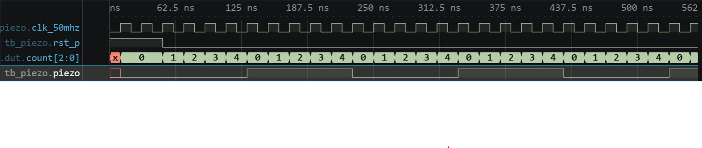

# 실험 전 레포트: LAB3-21 · 피에조 단일 음

작성자: 박건우 (2025440050) / 작성일: 2026-09-26 / 소스 커밋: (GitHub push 후 기재) / workspace: `lab3_21_piezo/FPGA.code-workspace` / OS: Windows / Python: (01 Check tools 출력 기재) / 시뮬레이터 버전: Icarus Verilog 12.0 (devel) (s20150603-1539-g2693dd32b)

## 목적과 예상 동작

50 MHz를 분주하여 피에조에 294 Hz 사각파를 출력한다 [1].

반주기 `HALF_PERIOD = CLK_HZ/(2×TONE_HZ)`만큼 `count`를 세고, `count == HALF_PERIOD-1`일 때 `count`를 0으로 되돌리며 `piezo`를 반전한다 [1].

반전 두 번이 한 주기이므로 출력 주파수는 `CLK_HZ/(2×HALF_PERIOD)`이고 듀티는 50%이다. 정수 나눗셈이므로 나머지는 버려진다 [1].

핵심 파라미터 계산

| 항목 | 보드 (50 MHz) | TB |
|---|---|---|
| `HALF_PERIOD` | 50,000,000/(2×294) = 85,034 (나머지 버림) | 1,000/(2×100) = 5클록 |
| 출력 주파수 | 50,000,000/170,068 ≈ 294.000 Hz | 한 주기 10클록 = 200 ns |
| counter 폭 | 17비트 | 3비트 |

## 소스와 테스트벤치

- 설계 top: `lab3_piezo` / 시뮬레이션 top: `tb_piezo`
- RTL: [lab3_piezo.v](../../lab3_21_piezo/src/lab3_piezo.v)
- TB: [tb_piezo.sv](../../lab3_21_piezo/sim/tb_piezo.sv)
- XDC: [lab3_piezo.xdc](../../lab3_21_piezo/constraints/lab3_piezo.xdc)
- 기대 PASS: `LAB3_PIEZO_PASS edges=5`

설계 top `lab3_piezo` 하나가 분주기와 출력 레지스터를 모두 담당한다. TB `tb_piezo`는 리셋 해제 후 25클록 동안 매 상승 에지 1 ns 뒤에 `count`가 0이 되는 시점을 찾아 간격이 정확히 5클록인지 검사한다. XDC는 piezo 출력을 Y21에 배정한다 [1].

TB 자극과 기대 결과

| 순서 | TB 자극 | 기대 결과 |
|---|---|---|
| 1 | 리셋 3클록 후 해제 | count 0부터 계수 |
| 2 | 25클록 관찰 | 반전 간격 5클록, 반전 4회 이상 (실제 5회) |

## VS Code 실행 과정

File → Save All → Run Task 01 Check tools → 02 Simulate → 03 Open waveform 순서로 실행했다. 02 Simulate 결과 `LAB3_PIEZO_PASS edges=5`를 확인했다.

- PASS 로그: [simulation.txt](../../evidence/21/vscode/simulation.txt)
- 파형: [wave.vcd](../../evidence/21/vscode/wave.vcd)

| 시간 구간 | 입력 | 예상 | 실제 파형 | 해석 |
|---|---|---|---|---|
| 0–50 ns | rst_p=1 | piezo 0 | piezo 0 | 리셋 |
| 130 ns | — | 첫 반전 | piezo 0→1 | count 0~4 뒤 반전 |
| 130–530 ns | — | 100 ns마다 반전 | 230, 330, 430, 530 ns 반전 | 반주기 5클록 = 100 ns |

count가 0,1,2,3,4를 반복하고 4 다음 에지에서 piezo가 반전한다. HIGH·LOW 폭이 각각 100 ns로 같아 듀티 50%, 주기 200 ns이다. 종료 시각은 551 ns이다.

`count`가 `HALF_PERIOD-1`에서 0으로 돌아가는 순간이 경계이며, 이때마다 정확히 한 번만 반전해야 한다. 리셋 직후 첫 반주기도 같은 5클록이다.

## 코드 수정·실패·복구 실험

변경 위치: `sim/tb_piezo.sv` 7행 `TONE_HZ(100)` → `TONE_HZ(125)` (다른 음 주파수)

실행 전 예상: `HALF_PERIOD` = 1,000/(2×125) = 4클록으로 줄어 반전 간격이 5에서 4로 바뀐다. 주파수가 높아지므로 보드라면 더 높은 음이 된다.

| 단계 | 실행 폴더·로그 | 입력·기대값·실제값 | 해석 |
|---|---|---|---|
| 정상 (22:31:19) | run-3024974d… / simulation.txt | TONE_HZ=100, 간격 5 → PASS edges=5, 551 ns | 기준 동작 |
| 변경 (22:32:40) | run-e8c595f6… / simulation_modified.txt | TONE_HZ=125, 기대 5 → FATAL half period=4, 191 ns | 분주값 5→4 |
| 복구 (22:32:53) | run-36fa84fc… / simulation_restored.txt | TONE_HZ=100 → PASS edges=5, 551 ns | 원래 동작 재현 |

TB의 기대값은 바꾸지 않았다. 세 실행은 모두 `lab3_21_piezo/build/sim/` 아래 run 폴더에 있고, 로그를 `evidence/21/vscode/`에 복사했다.

## 보드 실험 계획

- 전원을 끈 상태에서 피에조 결선과 공통 GND를 확인한 뒤 bit를 기록한다 [1].
- 출력 주파수 약 294.000 Hz를 계산값으로 두고 실제 음 높이와 음량을 관찰한다 [1].

이 단계에서는 Vivado·보드 결과를 기록하지 않는다.

## 참고문헌

[1] 서울시립대학교 전자전기컴퓨터공학부, "전자전기컴퓨터설계실험Ⅱ LAB3 교안: FPGA 응용회로 공통 예습 및 LAB3-19–25 Vivado 매뉴얼", 2026.
