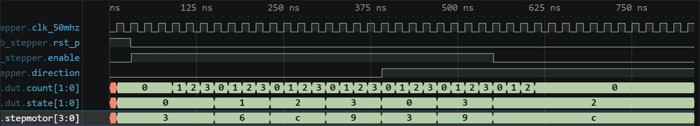

# 실험 전 레포트: LAB3-22 · 스텝모터 위상 제어

작성자: 박건우 (2025440050) / 작성일: 2026-09-26 / 소스 커밋: (GitHub push 후 기재) / workspace: `lab3_22_stepper/FPGA.code-workspace` / OS: Windows / Python: (01 Check tools 출력 기재) / 시뮬레이터 버전: Icarus Verilog 12.0 (devel) (s20150603-1539-g2693dd32b)

## 목적과 예상 동작

clock-enable마다 4상 코일 패턴을 이동하여 정·역회전과 정지를 제어한다 [1].

`enable`, `direction`은 레벨 입력이지만 2단 동기화(`*_meta`→`*_sync`)를 거친다 [1, 2].

`enable_sync=0`이면 `count`만 0으로 두고 `state`를 유지하여 정지한다. `enable_sync=1`이면 `count`가 `STEP_CYCLES-1`에 도달할 때마다 `state`를 정방향 +1, 역방향(`direction_sync=1`) −1 한다 [1].

`state` 0/1/2/3은 조합논리로 `stepmotor` = 0011/0110/1100/1001에 대응한다. 한 단계마다 활성 코일 한 개가 바뀐다.

핵심 파라미터 계산

| 항목 | 보드 (50 MHz) | TB |
|---|---|---|
| `STEP_CYCLES = CLK_HZ/STEP_HZ` | 50,000,000/100 = 500,000클록 | 8/2 = 4클록 |
| step 간격 | 10 ms (100 step/s) | 80 ns |
| counter 폭 | 19비트 | 2비트 |

## 소스와 테스트벤치

- 설계 top: `lab3_stepper` / 시뮬레이션 top: `tb_stepper`
- RTL: [lab3_stepper.v](../../lab3_22_stepper/src/lab3_stepper.v)
- TB: [tb_stepper.sv](../../lab3_22_stepper/sim/tb_stepper.sv)
- XDC: [lab3_stepper.xdc](../../lab3_22_stepper/constraints/lab3_stepper.xdc)
- 기대 PASS: `LAB3_STEPPER_PASS checks=8`

설계 top `lab3_stepper`는 입력 동기화, step clock-enable 카운터, 위상 디코더를 포함한다. TB `tb_stepper`는 정방향 한 주기, 역방향 두 단계, enable=0 유지를 `check_value`로 8회 검사한다. XDC는 enable N8, direction N4, stepmotor[3:0] Y20/Y22/AA20/AA21을 지정한다 [1].

TB 자극과 기대 결과

| 순서 | TB 자극 | 기대 결과 (stepmotor) |
|---|---|---|
| 1 | 리셋 해제 | 0011 |
| 2 | enable=1, 정방향 4단계 | 0110 → 1100 → 1001 → 0011 |
| 3 | direction=1, 역방향 2단계 | 1001 → 1100 |
| 4 | enable=0 후 12클록 | 1100 유지 |

## VS Code 실행 과정

File → Save All → Run Task 01 Check tools → 02 Simulate → 03 Open waveform 순서로 실행했다. 02 Simulate 결과 `LAB3_STEPPER_PASS checks=8`를 확인했다.

- PASS 로그: [simulation.txt](../../evidence/22/vscode/simulation.txt)
- 파형: [wave.vcd](../../evidence/22/vscode/wave.vcd)

| 시간 구간 | 입력 | 예상 | 실제 파형 | 해석 |
|---|---|---|---|---|
| 31→70 ns | enable 0→1 | 2클록 뒤 enable_sync | enable_sync 70 ns | 2단 동기화 |
| 150–390 ns | 정방향 | 80 ns마다 한 단계 | 6 (150) → C (230) → 9 (310) → 3 (390) | 4클록 = 80 ns 간격 |
| 391→430 ns | direction 0→1 | 동기화 후 역방향 | direction_sync 430 ns | — |
| 470–550 ns | 역방향 | 9 → C | 9 (470), C (550) | state 0→3→2 |
| 551–831 ns | enable=0 | C 유지 | C 유지, 종료 831 ns | 정지 상태에서 위상 고정 |

count가 0~3을 반복할 때마다 state가 한 칸 이동하고 stepmotor가 3→6→C→9→3 순서를 보인다. direction 전환 뒤에는 3→9→C로 역순이 되고, enable이 0이 된 뒤에는 count가 0에 머물고 stepmotor는 C를 유지한다.

경계 조건은 state 3→0(정방향)과 0→3(역방향) 순환, 그리고 enable 해제 시 현재 위상 유지이다. TB는 위상 순서만 검사하고 step 간격은 검사하지 않는다.

## 코드 수정·실패·복구 실험

변경 위치: `sim/tb_stepper.sv` 7행 `STEP_HZ(2)` → `STEP_HZ(1)` (절반)

실행 전 예상: `STEP_CYCLES` = 8/1 = 8클록 = 160 ns로 step 간격이 두 배가 된다. TB는 순서만 검사하므로 PASS가 예상되고, 종료 시각이 늦어진다. 보드 기준으로는 50 step/s(20 ms 간격)로 회전 속도가 절반이 된다.

| 단계 | 실행 폴더·로그 | 입력·기대값·실제값 | 해석 |
|---|---|---|---|
| 정상 (22:33:11) | run-99bcd957… / simulation.txt | STEP_HZ=2 → PASS checks=8, 831 ns, 간격 80 ns | 기준 동작 |
| 변경 (22:34:33) | run-9055cbd8… / simulation_modified.txt | STEP_HZ=1 → PASS checks=8, 1,311 ns, 간격 160 ns (VCD) | FAIL 없음, 간격 2배 |
| 복구 (22:34:44) | run-1a5da09e… / simulation_restored.txt | STEP_HZ=2 → PASS checks=8, 831 ns | 원래 동작 재현 |

TB의 기대값은 바꾸지 않았다. 세 실행은 모두 `lab3_22_stepper/build/sim/` 아래 run 폴더에 있고, 로그를 `evidence/22/vscode/`에 복사했다.

## 보드 실험 계획

- 전원을 끈 상태에서 모터 드라이버 결선과 공통 GND를 확인한다. 모터는 FPGA 핀에서 직접 구동하지 않고 드라이버와 별도 전원을 사용한다 [1].
- 드라이버 결선 후 회전 방향(N4), 단계 속도, 정지 유지(N8=0)와 모터 발열을 관찰한다 [1]. 예상 step 속도는 100 step/s이다.

이 단계에서는 Vivado·보드 결과를 기록하지 않는다.

## 참고문헌

[1] 서울시립대학교 전자전기컴퓨터공학부, "전자전기컴퓨터설계실험Ⅱ LAB3 교안: FPGA 응용회로 공통 예습 및 LAB3-19–25 Vivado 매뉴얼", 2026.

[2] M. Morris Mano and Michael D. Ciletti, *Digital Design: With an Introduction to the Verilog HDL, VHDL, and SystemVerilog*, 6th ed., Pearson, 2018.
