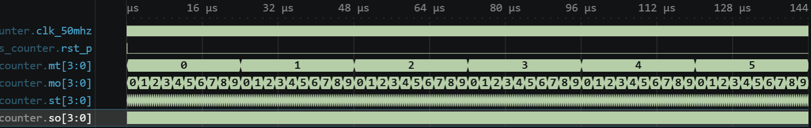

# 실험 전 레포트: LAB3-23 · MM:SS 시계

작성자: 박건우 (2025440050) / 작성일: 2026-09-26 / 소스 커밋: (GitHub push 후 기재) / workspace: `lab3_23_mmss_clock/FPGA.code-workspace` / OS: Windows / Python: (01 Check tools 출력 기재) / 시뮬레이터 버전: Icarus Verilog 12.0 (devel) (s20150603-1539-g2693dd32b)

## 목적과 예상 동작

1초 enable로 00:00부터 59:59까지 계수하고 4자리 7세그먼트를 스캔한다 [1].

`mmss_counter`는 `subsecond`를 0~`CLK_HZ-1`로 세고, 끝값에서 초 일의 자리를 올린다. 일의 자리 9→0이면 십의 자리, 초 59→00이면 분, 59:59 다음은 00:00이 되는 BCD 자리올림이다 [1, 2].

`sevenseg_decode`는 숫자를 {a,b,c,d,e,f,g,dp} active-high 코드로 바꾼다 (0 = FC, 9 = F6). `lab3_mmss_clock`은 `SCAN_CYCLES`마다 `scan_select`를 바꿔 자리 선택 `seg_com`(active-low F7→FB→FD→FE)과 `seg_data`를 출력하며, 분 일의 자리에는 dp를 켜서 분·초를 구분한다 [1].

핵심 파라미터 계산

| 항목 | 보드 (50 MHz) | TB |
|---|---|---|
| 1초 enable | 50,000,000클록 (`subsecond` 26비트) | `CLK_HZ(2)`: 2클록 = 40 ns |
| 자리 스캔 `CLK_HZ/SCAN_HZ` | 12,500클록 = 250 µs/자리, 4자리 1 ms | TB는 `mmss_counter`만 검사 |
| 전체 순환 | 3,600초 | 3,600×40 ns = 144 µs |

## 소스와 테스트벤치

- 설계 top: `lab3_mmss_clock` / 시뮬레이션 top: `tb_mmss_counter`
- RTL: [sevenseg_decode.v](../../lab3_23_mmss_clock/src/sevenseg_decode.v), [mmss_counter.v](../../lab3_23_mmss_clock/src/mmss_counter.v), [lab3_mmss_clock.v](../../lab3_23_mmss_clock/src/lab3_mmss_clock.v)
- TB: [tb_mmss_counter.sv](../../lab3_23_mmss_clock/sim/tb_mmss_counter.sv)
- XDC: [lab3_mmss_clock.xdc](../../lab3_23_mmss_clock/constraints/lab3_mmss_clock.xdc)
- 기대 PASS: `LAB3_MMSS_PASS checks=7`

설계 top `lab3_mmss_clock`은 `mmss_counter`, 디코더 4개, 스캔 카운터로 구성된다. 기능 TB `tb_mmss_counter`는 `mmss_counter`와 디코더를 직접 인스턴스하여 디코더 2회와 시간 5회를 검사한다. XDC는 seg_data[7:0] H2/J7/J3/J1/E4/E2/F5/F1, seg_com[7:0] K5/K3/K1/L6/G3/G1/H6/H4를 지정한다 [1].

TB 자극과 기대 결과

| 순서 | TB 자극 | 기대 결과 |
|---|---|---|
| 1 | 디코더 입력 0, 9 | FC, F6 |
| 2 | 리셋 해제 | 00:00 |
| 3 | 10초 진행 | 00:10 (00:09→00:10 자리올림) |
| 4 | 50초 진행 | 01:00 (00:59→01:00) |
| 5 | 3,539초 진행 | 59:59 |
| 6 | 1초 진행 | 00:00 (59:59→00:00) |

## VS Code 실행 과정

File → Save All → Run Task 01 Check tools → 02 Simulate → 03 Open waveform 순서로 실행했다. 02 Simulate 결과 `LAB3_MMSS_PASS checks=7`를 확인했다.

- PASS 로그: [simulation.txt](../../evidence/23/vscode/simulation.txt)
- 파형: [wave.vcd](../../evidence/23/vscode/wave.vcd)

| 시간 구간 | 입력 | 예상 | 실제 파형 | 해석 |
|---|---|---|---|---|
| 0–30 ns | rst_p=1 | 00:00 | 00:00 | 리셋 |
| 410 ns | 10초 | 00:10 | 410 ns에 00:10 | 1초 = 40 ns |
| 2410 ns | 60초 | 01:00 | 2,410 ns에 01:00 | 초 59 → 분 올림 |
| 143,970 ns | 3,599초 | 59:59 | 143,970 ns에 59:59 | 최댓값 |
| 144,010 ns | 3,600초 | 00:00 | 144,010 ns에 00:00, 종료 144,031 ns | 전체 순환 |

Zoom Fit 화면에서 mt가 0~5 여섯 값을 차례로 거치고 각 구간에서 mo가 0→9를 반복하여 3,600초 전체 순환을 보여준다. st, so는 전체 화면에서는 촘촘하여 값이 보이지 않으므로 자리올림 시각은 VCD 값으로 확인했다.

경계는 초 일의 자리 9→0, 초 59→00(분 올림), 분 59:59→00:00이다. 세 경계를 모두 TB가 직접 검사한다.

## 코드 수정·실패·복구 실험

변경 위치: `sim/tb_mmss_counter.sv` 9행 `mmss_counter #(.CLK_HZ(2))` → `CLK_HZ(4)` (TB 클록 20 ns 유지)

실행 전 예상: 1초가 4클록(80 ns)이 되므로 TB가 20클록(10초 분량)을 진행해도 5초만 증가한다. 자리올림 간격이 2배로 늘어 00:10 검사에서 00:05가 된다.

| 단계 | 실행 폴더·로그 | 입력·기대값·실제값 | 해석 |
|---|---|---|---|
| 정상 (22:35:01) | run-154002bb… / simulation.txt | CLK_HZ=2 → PASS checks=7, 144,031 ns | 기준 동작 |
| 변경 (22:36:28) | run-93aadc5d… / simulation_modified.txt | CLK_HZ=4, 기대 00:10 → FATAL time=00:05, 431 ns | 1초 간격 2배 |
| 복구 (22:36:36) | run-56d41785… / simulation_restored.txt | CLK_HZ=2 → PASS checks=7, 144,031 ns | 원래 동작 재현 |

TB의 기대값은 바꾸지 않았다. 세 실행은 모두 `lab3_23_mmss_clock/build/sim/` 아래 run 폴더에 있고, 로그를 `evidence/23/vscode/`에 복사했다.

## 보드 실험 계획

- 전원을 끈 상태에서 결선과 공통 GND를 확인한 뒤 bit를 기록한다 [1].
- 자리 순서와 극성, 분·초 구분점, 1초 간격과 59:59 다음 00:00 순환을 확인한다 [1]. 자리당 250 µs 스캔이므로 네 자리가 동시에 켜진 것처럼 보일 것으로 예상한다.

이 단계에서는 Vivado·보드 결과를 기록하지 않는다.

## 참고문헌

[1] 서울시립대학교 전자전기컴퓨터공학부, "전자전기컴퓨터설계실험Ⅱ LAB3 교안: FPGA 응용회로 공통 예습 및 LAB3-19–25 Vivado 매뉴얼", 2026.

[2] M. Morris Mano and Michael D. Ciletti, *Digital Design: With an Introduction to the Verilog HDL, VHDL, and SystemVerilog*, 6th ed., Pearson, 2018.
