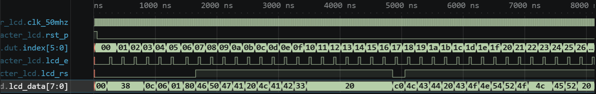

# 실험 전 레포트: LAB3-24 · 문자 LCD 제어

작성자: 박건우 (2025440050) / 작성일: 2026-09-26 / 소스 커밋: (GitHub push 후 기재) / workspace: `lab3_24_character_lcd/FPGA.code-workspace` / OS: Windows / Python: (01 Check tools 출력 기재) / 시뮬레이터 버전: Icarus Verilog 12.0 (devel) (s20150603-1539-g2693dd32b)

## 목적과 예상 동작

HD44780 호환 LCD를 8비트 write-only 방식으로 초기화하고 두 줄 문자열을 표시한다 [1].

`TICK_CYCLES`마다 1클록 `tick`을 만들고, 전원 대기 `POWER_TICKS`가 끝나면 바이트마다 phase 0(RS·DATA 설정, E=0) → 1(E=1) → 2(E=0) → 3(대기)을 반복한다. 데이터는 E 하강 에지에 기록된다 [1].

index 0~6은 명령(RS=0) 38·38·38·0C·06·01·80, 7~22는 첫째 줄 "FPGA LAB3"와 공백, 23은 둘째 줄 주소 C0, 24~39는 "LCD CONTROLLER"와 공백(RS=1)이다. 0x01(clear) 뒤에는 `CLEAR_WAIT_TICKS`, 나머지는 `NORMAL_WAIT_TICKS`만큼 기다린다. `lcd_rw`는 0으로 고정한다 [1].

핵심 파라미터 계산

| 항목 | 보드 (50 MHz) | TB |
|---|---|---|
| tick `TICK_CYCLES` | 500클록 = 10 µs | 2클록 = 40 ns |
| 전원 대기 | 2,000 tick = 20 ms | 3 tick |
| 일반/clear 대기 | 4 tick = 40 µs / 200 tick = 2 ms | 1 / 2 tick |
| E setup·high | 각 1 tick = 10 µs | 각 40 ns |

## 소스와 테스트벤치

- 설계 top: `lab3_character_lcd` / 시뮬레이션 top: `tb_character_lcd`
- RTL: [lab3_character_lcd.v](../../lab3_24_character_lcd/src/lab3_character_lcd.v)
- TB: [tb_character_lcd.sv](../../lab3_24_character_lcd/sim/tb_character_lcd.sv)
- XDC: [lab3_character_lcd.xdc](../../lab3_24_character_lcd/constraints/lab3_character_lcd.xdc)
- 기대 PASS: `LAB3_LCD_PASS bytes=40`

설계 top `lab3_character_lcd` 하나에 tick 발생기, 바이트 표(ROM), 쓰기 순서기가 있다. TB `tb_character_lcd`는 기대 바이트·RS 표 40개를 두고 `lcd_e` 하강 에지마다 RW, RS, DATA를 비교한다. XDC는 lcd_e A6, lcd_rs G6, lcd_rw D6, lcd_data[7:0] A4/B2/C3/D4/A2/C5/C1/D1을 지정한다 [1].

TB 자극과 기대 결과

| index | RS | 기대 DATA |
|---|---|---|
| 0–6 | 0 | 38 38 38 0C 06 01 80 |
| 7–22 | 1 | "FPGA LAB3" + 공백 7개 |
| 23 | 0 | C0 |
| 24–39 | 1 | "LCD CONTROLLER" + 공백 2개 |

## VS Code 실행 과정

File → Save All → Run Task 01 Check tools → 02 Simulate → 03 Open waveform 순서로 실행했다. 02 Simulate 결과 `LAB3_LCD_PASS bytes=40`를 확인했다.

- PASS 로그: [simulation.txt](../../evidence/24/vscode/simulation.txt)
- 파형: [wave.vcd](../../evidence/24/vscode/wave.vcd)

| 시간 구간 | 입력 | 예상 | 실제 파형 | 해석 |
|---|---|---|---|---|
| 0–250 ns | 리셋·전원 대기 | E=0 | 첫 E 상승 250 ns | POWER_TICKS 3 |
| 290 ns | — | index 0, 38 | 첫 E 하강 290 ns, data 38 | 명령 쓰기 |
| 1,730 ns | — | index 7, 'F'(46) | rs 1로 전환, data 46 | 첫째 줄 시작 |
| 4,930 ns | — | index 23, C0 | rs 0, data C0 | 둘째 줄 주소 |
| 8,130 ns | — | 40번째 바이트 | 종료 8,130 ns | bytes=40 |

index가 00→27(=39)까지 한 칸씩 증가하고, lcd_e 펄스마다 lcd_data가 38·0C·06·01·80 뒤 46 50 47 41(‘FPGA’)…, C0 뒤 4C 43 44(‘LCD’)… 순서로 바뀐다. lcd_rs는 문자 구간에서 1, 명령 구간(0~6, 23)에서 0이다.

경계는 명령/문자 전환(index 6→7, 22→23→24)의 RS 변화와 clear(01) 뒤 긴 대기이다. index 39 다음은 6(0x80)으로 돌아가 두 줄을 반복해서 쓴다.

## 코드 수정·실패·복구 실험

변경 위치: `src/lab3_character_lcd.v` 59행 index 24 `"L"` → `"X"` (둘째 줄 첫 글자)

실행 전 예상: index 24의 DATA가 0x4C('L') 대신 0x58('X')이 되어 TB가 해당 바이트에서 멈춘다. 보드라면 둘째 줄이 "XCD CONTROLLER"로 표시된다.

| 단계 | 실행 폴더·로그 | 입력·기대값·실제값 | 해석 |
|---|---|---|---|
| 정상 (22:36:52) | run-03bf9f04… / simulation.txt | 40바이트 일치 → PASS bytes=40, 8,130 ns | 기준 동작 |
| 변경 (22:38:13) | run-429f6cbf… / simulation_modified.txt | index 24 기대 4C → FATAL index=24 rs=1 data=58, 5,130 ns | ASCII 'X' = 0x58 |
| 복구 (22:38:20) | run-8b1bad96… / simulation_restored.txt | "L" 복구 → PASS bytes=40, 8,130 ns | 원래 동작 재현 |

TB의 기대값은 바꾸지 않았다. 세 실행은 모두 `lab3_24_character_lcd/build/sim/` 아래 run 폴더에 있고, 로그를 `evidence/24/vscode/`에 복사했다.

## 보드 실험 계획

- 전원을 끈 상태에서 5 V/3.3 V 결선과 대비(contrast)를 먼저 확인한다 [1].
- bit 기록 후 첫째 줄 "FPGA LAB3", 둘째 줄 "LCD CONTROLLER"가 표시되는지 확인한다 [1].

이 단계에서는 Vivado·보드 결과를 기록하지 않는다.

## 참고문헌

[1] 서울시립대학교 전자전기컴퓨터공학부, "전자전기컴퓨터설계실험Ⅱ LAB3 교안: FPGA 응용회로 공통 예습 및 LAB3-19–25 Vivado 매뉴얼", 2026.
