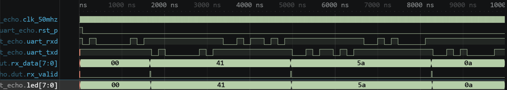

# 실험 전 레포트: LAB3-25 · PC–FPGA UART 에코

작성자: 박건우 (2025440050) / 작성일: 2026-09-26 / 소스 커밋: (GitHub push 후 기재) / workspace: `lab3_25_uart_echo/FPGA.code-workspace` / OS: Windows / Python: (01 Check tools 출력 기재) / 시뮬레이터 버전: Icarus Verilog 12.0 (devel) (s20150603-1539-g2693dd32b)

## 목적과 예상 동작

9600 8N1로 받은 한 바이트를 그대로 송신하고 LED에 마지막 수신값을 표시한다 [1].

bit 시간은 반올림한 `DIV = (CLK_HZ + BAUD/2)/BAUD` 클록이다 [1].

`uart_rx`는 RX를 2단 동기화한 뒤 LOW를 감지하면 `DIV/2-1`만큼 기다려 start bit 중앙에서 다시 LOW인지 확인하고, 이후 `DIV`마다 8비트를 LSB부터 샘플링한다. stop bit가 HIGH이면 `valid`, 아니면 `framing_error`를 1클록 낸다 [1].

`uart_tx`는 `ready`일 때 `valid`를 받아 {1, data, 0} 10비트를 LSB부터 `DIV`마다 내보낸다. top은 `rx_valid`에서 `last_data`(LED)를 갱신하고 `tx_ready`이면 같은 바이트를 송신한다 [1].

핵심 파라미터 계산

| 항목 | 보드 (50 MHz) | TB |
|---|---|---|
| `DIV` | (50,000,000+4,800)/9,600 = 5,208 | (800+50)/100 = 8클록 |
| bit 시간 | 5,208×20 ns = 104.16 µs | 160 ns |
| 실제 baud / 오차 | ≈ 9,600.6 bps / +0.006% | — |
| 한 프레임 (10비트) | ≈ 1.04 ms | 1,600 ns |

## 소스와 테스트벤치

- 설계 top: `lab3_uart_echo` / 시뮬레이션 top: `tb_uart_echo`
- RTL: [uart.v](../../lab3_25_uart_echo/src/uart.v), [lab3_uart_echo.v](../../lab3_25_uart_echo/src/lab3_uart_echo.v)
- TB: [tb_uart_echo.sv](../../lab3_25_uart_echo/sim/tb_uart_echo.sv)
- XDC: [lab3_uart_echo.xdc](../../lab3_25_uart_echo/constraints/lab3_uart_echo.xdc)
- 기대 PASS: `LAB3_UART_ECHO_PASS checks=3`

설계 top `lab3_uart_echo`는 `uart_rx`, `uart_tx`와 에코 레지스터를 가진다. TB `tb_uart_echo`는 DIV=8의 독립 직렬 송신(`send_byte`)·수신(`receive_byte`) 모델로 0x41, 0x5A, 0x0A를 보내고 에코 값과 LED, framing error 부재를 검사한다. XDC는 uart_rxd C6, uart_txd F6, LED[7:0]을 지정한다 [1].

TB 자극과 기대 결과

| 순서 | TB 자극 | 기대 결과 |
|---|---|---|
| 1 | 0x41 송신 | txd 에코 0x41, led 41 |
| 2 | 0x5A 송신 | 에코 0x5A, led 5A |
| 3 | 0x0A 송신 | 에코 0x0A, led 0A, framing error 없음 |

## VS Code 실행 과정

File → Save All → Run Task 01 Check tools → 02 Simulate → 03 Open waveform 순서로 실행했다. 02 Simulate 결과 `LAB3_UART_ECHO_PASS checks=3`를 확인했다.

- PASS 로그: [simulation.txt](../../evidence/25/vscode/simulation.txt)
- 파형: [wave.vcd](../../evidence/25/vscode/wave.vcd)

| 시간 구간 | 입력 | 예상 | 실제 파형 | 해석 |
|---|---|---|---|---|
| 70 ns | rxd start bit (0x41) | — | rxd 1→0 | 수신 시작 |
| 1,650–1,690 ns | stop bit 확인 | rx_valid 1클록 | rx_valid 1,650 ns, led 41 (1,670), txd start 1,690 ns | 수신 → 송신 |
| 4,950 ns | 0x5A | rx_valid, 에코 | rx_data 5A, txd start 4,990 ns | 두 번째 바이트 |
| 8,250 ns | 0x0A | rx_valid, 에코 | rx_data 0A, txd start 8,290 ns | 세 번째 바이트 |
| 9,970 ns | — | PASS | 종료 9,970 ns | checks=3 |

uart_rxd의 한 프레임이 끝나면 rx_valid가 1클록 펄스로 뜨고, rx_data와 led가 41→5A→0A로 바뀐다. 그 직후 uart_txd가 같은 비트 패턴을 160 ns 간격으로 다시 내보낸다.

경계는 start bit 중앙 확인(잡음 펄스 거부)과 stop bit 확인이다. 이번 TB의 정상 입력에서는 framing error가 발생하지 않음을 마지막에 검사한다.

## 코드 수정·실패·복구 실험

변경 위치: `sim/tb_uart_echo.sv` 10행 DUT 파라미터 `BAUD(100)` → `BAUD(200)` (DUT의 송·수신 모듈에 같은 DIV가 적용됨)

실행 전 예상: DUT의 `DIV` = (800+100)/200 = 4클록(80 ns)으로 줄어든다. TB 직렬 모델은 `DIV=8`(160 ns)로 그대로이므로 bit 시간이 서로 달라 잘못된 바이트를 받아 에코 값이 0x41과 달라질 것으로 예상한다.

| 단계 | 실행 폴더·로그 | 입력·기대값·실제값 | 해석 |
|---|---|---|---|
| 정상 (22:38:36) | run-af52ff2a… / simulation.txt | BAUD=100 → PASS checks=3, 9,970 ns | 기준 동작 |
| 변경 (22:40:04) | run-f3ff2661… / simulation_modified.txt | BAUD=200, 기대 41 → FATAL echo=fa expected=41, 3,230 ns | DUT 80 ns / TB 160 ns bit 불일치 |
| 복구 (22:40:11) | run-3e27c7d6… / simulation_restored.txt | BAUD=100 → PASS checks=3, 9,970 ns | 원래 동작 재현 |

TB의 기대값은 바꾸지 않았다. 세 실행은 모두 `lab3_25_uart_echo/build/sim/` 아래 run 폴더에 있고, 로그를 `evidence/25/vscode/`에 복사했다.

## 보드 실험 계획

- 전원을 끈 상태에서 결선과 GND를 확인한다. UART는 TX↔RX 교차와 전압 레벨을 확인한다 [1].
- 터미널을 9600 8N1, local echo off로 설정하고 문자 하나를 보낼 때 반환 문자 하나와 LED 값이 맞는지 확인한다 [1]. 예: 'A'를 보내면 'A'가 돌아오고 LED는 0x41(01000001)을 표시한다.

이 단계에서는 Vivado·보드 결과를 기록하지 않는다.

## 참고문헌

[1] 서울시립대학교 전자전기컴퓨터공학부, "전자전기컴퓨터설계실험Ⅱ LAB3 교안: FPGA 응용회로 공통 예습 및 LAB3-19–25 Vivado 매뉴얼", 2026.
